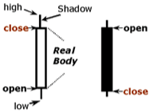

# Senior Developer Test

## The goal of this test 
is to demonstrate your knowledge in development practices, tools and techniques by solving a relatively simple problem. 

## Input: Market data for 1 Hour
### Csv format. 

#### Fields:
* Time with milliseconds (set format for excel dd/mm/yyyy hh:mm:ss.000)
* Quantity 
* Price

#### Output 
* DataGrid showing the CandleStick data and coloring the record green when price is going up and red when price going down 

#### Definition for Financial CandleStick
way for displaying summarized market data for a period of time (e.g. per minute) 

##### CandleStick has 5 values:
* Open  – First Price for the period
* Close – Last Price for the period 
* High – Max Price for the period
* Low– Min Price for the period
* Sum Volume – Summary of all Quantity at the period (not displayed in this image)

# Task 
* Read the market data from the file
* Calculate CandleStick values for each minute of data
* Display the values in DataGrid (no need to display graphics just text)
* Color record green when a record’s closing price is higher than its opening price, red otherwise. 

_Note: Show Results as text in grid (5 columns + date), no need to show graphical Candlesticks_
